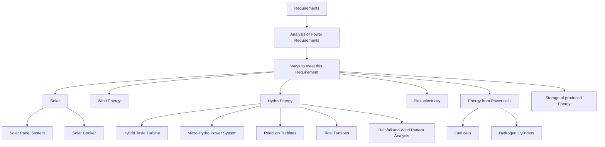
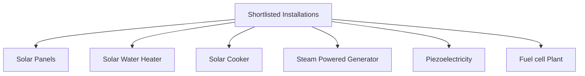

Skip to content
Gradescope
Q1 Think off-grid living:
15 Points
Grading comment:
Design a system to meet the entire energy needs of your home without drawing commercial electrical power from the utility.
Batch Submission Mode: Tribe Coordinator submits ONE MarkDown file and uploads ONE PDF file in each of the following sub-questions for all her/his Tribe Members.

In the MarkDown file, please ensure legibility by putting a blank line between paragraphs. There must be a Table of Contents. Section headings must be numbered. 

In the PDF file, ensure that the font is no larger than 12pt, lines are single spaced and the margin is no more than 2 cm all around (top/bottom/left/right: all 2cm wide maximum)

Q1.1 COMPLETE REPORT
15 Points
Grading comment:
Please submit (cut-and-paste in MarkDown format ) of your complete document (INCLUDING CLOSURE and RE-USE documents) here (must be GFM MarkDown compatible).

Deadline #4: 02 Feb 2022 Wednesday 0900 hours

---
title : SUNERGY 
number headings: first-level 2, max 6, 1.1., auto 
---

# ELP305 :Design and Systems Laboratory

# Semester 2, 2021-2022

# Tribe F

# Abstract

This document contains the requirements, specifications and design of equipments that will be required for a house in the perimeter of a rectangle of dimensions 150m x 60m to run solely on power that is not taken from the commercial supply. The requirements gives an idea of what all technologies we might be using for designing "Sunergic" home (listing 10 equipments to meet the requirements). The specifications lists the requirements in a more specific sense, after we have analyzed the energy requirements of the home and therefore is the trimmed list of requirements and gives more details about the equipments that are going to be used. Hence it talks about the power generation, cost of equipments, cost of maintainence and required amount. After specifications we have given the design, of how we plan to install these sources to power our house. It has design for each room and each power source (where they are and how they are connected), all the designs were made on CAD and design section contains screenshots of the CAD model.

# Motivation

The main goal is to develop an off-grid power system for a family home. The location of the house is near the coast of Bay of Bengal in Odisha, India. Since we have been given 6 members in our family, we have considered an average 3 BHK flat, and have estimated a 10.05 kWh average energy usage per day. After some analysis, we found that solar is most suitable and cost efficient way for small scale electricity production. Hence, solar has been taken as the main source of energy (at an average sunny day with 10 hours of sunlight, it can give 18 kWh energy). For the case that sun is not out due to rainy weather, we can use piezo along with steam power generation, to fulfill our need. However, if we run out of all option, in case of continued bad weather, we will have to resort to fuel cell which can power the house but is expensive. We have also installed storage units where we will store the extra energy generated on any given day to be used later.

# Table of Contents

- [List of Abbreviations](#list-of-abbreviations)
- [List of Tables](#list-of-tables)
- [List of Figures](#list-of-figures)
- [Main Content](#main-content)
	- [1. Authors](#authors)
		- [1.1. ProjectLibre Gantt Chart](#projectlibre-gantt-chart)
		- [1.2. ProjectLibre Work Packages](#projectlibre-work-packages)
		- [1.3. ProjectLibre Resource View](#projectlibre-resource-view)
		- [1.4. ProjectLibre CPM](#projectlibre-cpm)
	- [2. Documentation](#documentation)
		- [2.1. Documentation Statistics](#documentation-statistics---last-time-this-was-not-as-table----)
		- [2.2. Document Readability Indices](#document-readability-indices)
	- [3. Requirements](#requirements)
		- [3.1. Analysis of Power requirement](#analysis-of-power-requirement)
		- [3.2. Ways to meet this requirement:](#ways-to-meet-this-requirement)
			- [3.2.1. Solar Energy](#solar-energy)
				- [3.2.1.1. Solar Panel System(Off-Grid)](#solar-panel-systemoff-grid)
				- [3.2.1.2. Solar Cooker](#solar-cooker)
			- [3.2.2. Wind Energy](#wind-energy)
			- [3.2.3. Hydro Energy](#hydro-energy)
				- [3.2.3.1. Hybrid Tesla Turbine](#hybrid-tesla-turbine)
				- [3.2.3.2. Micro-hydropower system](#micro-hydropower-system)
				- [3.2.3.3. Reaction Turbines](#reaction-turbines)
				- [3.2.3.4. Tidal Turbines](#tidal-turbines)
				- [3.2.3.5. Rainfall and Wind pattern analysis](#rainfall-and-wind-pattern-analysis)
			- [3.2.4. Piezoelectricity](#piezoelectricity)
			- [3.2.5. Energy from Power Cells/Cylinders](#energy-from-power-cellscylinders)
				- [3.2.5.1. Fuel Cell](#fuel-cell)
				- [3.2.5.2. Hydrogen cylinder](#hydrogen-cylinder)
			- [3.2.6. Storage of the produced energy](#storage-of-the-produced-energy)
		- [3.3. Remarks](#remarks)
	- [4. Specifications](#specifications)
		- [4.1. Tabled Summary](#tabled-summary)
	- [5. Design of the House](#design-of-the-house)
		- [5.1. Connections in Different rooms of the House](#connections-in-different-rooms-of-the-house)
			- [5.1.1. Kitchen](#kitchen)
			- [5.1.2. Living Room](#living-room)
			- [5.1.3. Bedrooms](#bedrooms)
			- [5.1.4. Bathrooms](#bathrooms)
		- [5.2. Different SUNERGY Installations](#different-sunergy-installations)
			- [5.2.1. Solar Panel System](#solar-panel-system)
			- [5.2.2. Piezoelectricity](#piezoelectricity)
			- [5.2.3. Steam Powered Plant](#steam-powered-plant)
			- [5.2.4. Fuel cells](#fuel-cells)
	- [6. Vendor Information](#vendor-information)
		- [6.1. Solar Panel System](#solar-panel-system)
		- [6.2. Piezoelectricity](#piezoelectricity)
		- [6.3. Steam Powered Plant](#steam-powered-plant)
		- [6.4. Fuel cell](#fuel-cell)
		- [6.5. Summary of Vendor Information](#summary-of-vendor-information)
	- [7. Closure](#closure)
	- [8. Re-use](#re-use)
		- [8.1. For Equipment](#for-equipment)
			- [8.1.1. Piezoelectricity](#piezoelectricity)
			- [8.1.2. Solar Energy](#solar-energy)
			- [8.1.3. Fuel Cells and Steam powered plants](#fuel-cells-and-steam-powered-plants)
		- [8.2. For the Team](#for-the-team)
	- [9. Appendix](#appendix)
		- [9.1. Solar Panel System](#solar-panel-system)
			- [9.1.1. Working](#working)
			- [9.1.2. Initial Capital Investment](#initial-capital-investment)
		- [9.2. Solar Water Heater](#solar-panel-system)
			- [9.2.1. Working](#working)
			- [9.2.2. Uses of solar water heater](#uses-of-solar-water-heater)
			- [9.2.3. Cost anaylsis](#cost-anaylsis)
		- [9.3. Solar Cooker](#solar-cooker)
			- [9.3.1. Working Principle](#working-principle)
			- [9.3.2. Power Delivered](#power-delivered)
			- [9.3.3. Capacity of device](#capacity-of-device)
			- [9.3.4. Cost Analysis](#cost-analysis)
		- [9.4. Steam Power Generator](#steam-power-generator)
			- [9.4.1. Working](#working)
			- [9.4.2. Initial Capital Investment](#initial-capital-investment)
			- [9.4.3. Power delivered](#power-delivered)
			- [9.4.4. Devices which can be run](#devices-which-can-be-run)
		- [9.5. Piezo Energy Generator](#piezo-energy-generator)
			- [9.5.1. Components and their specification](#components-and-their-specification)
			- [9.5.2. Power Generation](#power-generation)
			- [9.5.3. Uses](#uses)
			- [9.5.4. Cost](#cost)
		- [9.6. Fuel Cell](#fuel-cell)
			- [9.6.1. Materials](#materials)
			- [9.6.2. Hydrogen Storage](#hydrogen-storage)
			- [9.6.3. Power Generation](#power-generation)
			- [9.6.4. Cost analysis](#cost-analysis)
			- [9.6.5. Uses](#uses)
			- [9.6.6. Space Requirements](#space-requirements)
	- [10. References](#references)

# List of Abbreviations

| Abbreviation | Meaning                            |
|:------------:|:----------------------------------:|
| PI           | Participation Index                |
| gpm          | Galleons per minute                |
| PZT          | Lead Zirconate Titanate            |
| PVDF         | Polyvinylidene Diflouride          |
| SWH          | Solar Water Heater                |
| DIY          | Do it yourself                     |
| PEMFCs       | Proton Exchange membrane fuel cell |

# List of Tables

| Table    | Description                                                     | Sub-section |
|:--------:|:---------------------------------------------------------------:|:-----------:|
| Table 1  | List of Authors                                                 | 1           |
| Table 2  | Documentation Team                                              | 2           |
| Table 3  | Documentation Statistics                                        | 2.1         |
| Table 4  | Document Readability Indices                                    | 2.2         |
| Table 5  | Power Requirement of the house                                  | 3.1         |
| Table 6  | Summary of Specifications                                       | 4.1         |
| Table 7  | Vendor Information of Solar Panel System                        | 6.1         |
| Table 8  | Vendor Information of Piezoelectricity                          | 6.2         |
| Table 9  | Vendor Information Steam Powered Plant                          | 6.3         |
| Table 10 | Vendor Information Fuel Cell                                    | 6.4         |
| Table 11 | Summary of Vendor Information                                   | 6.5         |
| Table 12 | Cost per component for a steam-powered generation plant         | 9.4.2       |
| Table 13 | Specifications of Components for steam-powered generation plant | 9.4.2       |
| Table 14 | Intensity of Rainfall and its classification                    | 9.5.1       |

#  List of Figures 

| Figure        | Description                                 | Sub-section |
|---------------|---------------------------------------------|-------------|
| Figure 1.1(a) | ProjectLibre : Gantt Chart                  | 1.1         |
| Figure 1.1(b) | ProjectLibre: Work Packages                 | 1.2         |
| Figure 1.1(c) | ProjectLibre: Resource View                 | 1.3         |
| Figure 1.1(d) | ProjectLibre: CPM                           | 1.4         |
| Figure 1.2(a) | Mind map for Requirements                   | 3           |
| Figure 1.2(b) | Mind map for Specifications                 | 4           |
| Figure 1.2(c) | Mind map for Design                         | 5           |
| Figure 2.1    | Overhead view of the Kitchen                | 5.1.1       |
| Figure 2.2    | Overhead view induction cooktop             | 5.1.1       |
| Figure 2.3    | Image of microwave oven                     | 5.1.1       |
| Figure 2.4    | Image of Double-door Refrigerator           | 5.1.1       |
| Figure 2.5    | Image of LED Bulb                           | 5.1.1       |
| Figure 2.6    | Image of the kitchen chinney                | 5.1.1       |
| Figure 3.1    | Overhead view of Living Room                | 5.1.2       |
| Figure 3.2    | Image of TV                                 | 5.1.2       |
| Figure 3.3    | Image of Laptop                             | 5.1.2       |
| Figure 3.4    | Image of Fan                                | 5.1.2       |
| Figure 3.5    | Image of LED bulb                           | 5.1.2       |
| Figure 3.6    | Image of tube-light                         | 5.1.2       |
| Figure 3.7    | Image of router                             | 5.1.2       |
| Figure 4.1    | Side view of Main Bedroom                   | 5.1.3       |
| Figure 4.2    | Overhead view of Main Bedroom               | 5.1.3       |
| Figure 4.3    | Side view of secondary Bedroom              | 5.1.3       |
| Figure 4.4    | Eagle eye view of secondary Bedroom         | 5.1.3       |
| Figure 4.5    | Top view of Both Secondary bedrooms         | 5.1.3       |
| Figure 5.1    | Front view of Bathroom                      | 5.1.4       |
| Figure 5.2    | Top right view of Bathroom                  | 5.1.4       |
| Figure 5.3    | Top left view of Bathroom                   | 5.1.4       |
| Figure 6.1    | Top view of Solar Panel System              | 5.2.1       |
| Figure 6.2    | Eagle eye view of Solar Panel System        | 5.2.1       |
| Figure 7.1    | Top side view of Piezoelectric Board System | 5.2.2       |
| Figure 8.1    | Top view of Steam Powered Plant             | 5.2.3       |
| Figure 8.2    | Top right view of Generator                 | 5.2.3       |
| Figure 8.3    | Top right view of Steam Turbine             | 5.2.3       |
| Figure 8.4    | Top right view of Rectifier                 | 5.2.3       |
| Figure 8.5    | Top right view of Water Source              | 5.2.3       |
| Figure 8.6    | Top right view of Water Inlet               | 5.2.3       |
| Figure 9.1    | Top view of Fuel Cell Plant                 | 5.2.4       |
| Figure 9.2    | Top-right view of Fuel cell Plant           | 5.2.4       |
| Figure 9.3    | Side view of Fuel cell                      | 5.2.4       |
| Figure 9.4    | Top right view of Hydrogen Storage          | 5.2.4       |

# List of Appendices

| Appendix sub-section | Description             |
| -------------------- | ----------------------- |
| 9.1                  | Solar Panel System      |
| 9.2                  | Solar Water Heater      |
| 9.3                  | Solar Cooker            |
| 9.4                  | Steam Powered Generator |
| 9.5                  | Piezo Energy Generator  |
| 9.6                  | Fuel Cells              |

# Main Content

## 1. Authors

**Table 1: List of Authors**

| Name                   | kerberos  | Email id                   | Role                  | PI  |
|------------------------|-----------|----------------------------|-----------------------|-----|
| Nehal Baradia          | ee3190584 | ee3190584@ee.iitd.ac.in    | Tribe Coordinator     | 1   |
| Aseem Gupta            | ee1190163 | ee1190163@ee.iitd.ac.in    | Sub group Coordinator | 1   |
| Siva Tanuj Gunta       | ee1190479 | ee1190479@ee.iitd.ac.in    | Sub group Coordinator | 1   |
| Payal Arora            | ee1190503 | ee1190503@ee.iitd.ac.in    | Sub group Coordinator | 1   |
| Peeyush Chourasiya     | ee1190504 | ee1190504@ee.iitd.ac.in    | Sub group Coordinator | 1   |
| Rohan Sharma           | ee3190121 | ee3190121@ee.iitd.ac.in    | Sub group Coordinator | 1   |
| Alok Singh             | ee3190553 | ee3190553@ee.iitd.ac.in    | Sub group Coordinator | 1   |
| Parth Manchanda        | ee3190587 | ee3190587@ee.iitd.ac.in    | Sub group Coordinator | 1   |
| Bhavuk Bhandula        | mt1190683 | mt1190683@maths.iitd.ac.in | Sub group Coordinator | 1   |
| Shravan Nawandar       | mt1190764 | mt1190764@maths.iitd.ac.in | Sub group Coordinator | 1   |
| Aarushi Gupta          | mt6190738 | mt6190738@maths.iitd.ac.in | Sub group Coordinator | 1   |
| Vineeth Ponugoti       | ee1190545 | ee1190545@ee.iitd.ac.in    | Sub group Coordinator | 1   |
| Sanika Singh           | mt6190837 | mt6190837@maths.iitd.ac.in | Group Member          | 1   |
| Abhishek Agarwal       | ee1180432 | ee1180432@ee.iitd.ac.in    | Group Member          | 0.8 |
| Kartikey Anand         | ee1190257 | ee1190257@ee.iitd.ac.in    | Group Member          | 1   |
| Abhilasha Abhilasha    | ee1190453 | ee1190453@ee.iitd.ac.in    | Group Member          | 1   |
| Abhinav Reddy Oruganti | ee1190455 | ee1190455@ee.iitd.ac.in    | Group Member          | 1   |
| Aryan Gupta            | ee1190466 | ee1190466@ee.iitd.ac.in    | Group Member          | 1   |
| Deepansh Jindal        | ee1190474 | ee1190474@ee.iitd.ac.in    | Group Member          | 1   |
| Harshul Mewal          | ee1190483 | ee1190483@ee.iitd.ac.in    | Group Member          | 1   |
| Kartik Parsoya         | ee1190488 | ee1190488@ee.iitd.ac.in    | Group Member          | 1   |
| Rahul Meena            | ee1190510 | ee1190510@ee.iitd.ac.in    | Group Member          | 1   |
| Sahil Bohra            | ee1190516 | ee1190516@ee.iitd.ac.in    | Group Member          | 1   |
| Sarthak Gupta          | ee1190520 | ee1190520@ee.iitd.ac.in    | Group Member          | 1   |
| Shashwat Saxena        | ee1190524 | ee1190524@ee.iitd.ac.in    | Group Member          | 0.3 |
| Shreyansh Kashaudhan   | ee1190528 | ee1190528@ee.iitd.ac.in    | Group Member          | 1   |
| Kshitij Alwadhi        | ee1190577 | ee1190577@ee.iitd.ac.in    | Group Member          | 1   |
| Shambhav Tewari        | ee1190657 | ee1190657@ee.iitd.ac.in    | Group Member          | 1   |
| Ashish Sharma          | ee3180530 | ee3180530@ee.iitd.ac.in    | Group Member          | 1   |
| Aryan Salve            | ee3190559 | ee3190559@ee.iitd.ac.in    | Group Member          | 1   |
| Gautam Bamba           | ee3190567 | ee3190567@ee.iitd.ac.in    | Group Member          | 1   |
| Jay Bisht              | ee3190575 | ee3190575@ee.iitd.ac.in    | Group Member          | 0.3 |
| Naman Gupta            | ee3190583 | ee3190583@ee.iitd.ac.in    | Group Member          | 1   |
| Nirjhar Das            | ee3190585 | ee3190585@ee.iitd.ac.in    | Group Member          | 1   |
| Priyansh Agarwal       | ee3190591 | ee3190591@ee.iitd.ac.in    | Group Member          | 0.3 |
| Tamanna Tanwar         | ee3190605 | ee3190605@ee.iitd.ac.in    | Group Member          | 1   |
| Chenika Garg           | ee3190877 | ee3190877@ee.iitd.ac.in    | Group Member          | 1   |
| Ayush Ashna            | mt1190079 | mt1190079@maths.iitd.ac.in | Group Member          | 0.5 |
| Rahul Singh            | mt1190285 | mt1190285@maths.iitd.ac.in | Group Member          | 1   |
| Shaurya Mohan          | mt1190658 | mt1190658@maths.iitd.ac.in | Group Member          | 1   |
| Anshuman Singh         | mt1190676 | mt1190676@maths.iitd.ac.in | Group Member          | 1   |
| Ayush Behera           | mt1190679 | mt1190679@maths.iitd.ac.in | Group Member          | 1   |
| Kaushal Verma          | mt1190700 | mt1190700@maths.iitd.ac.in | Group Member          | 1   |
| Pariket Bhagat         | mt1190711 | mt1190711@maths.iitd.ac.in | Group Member          | 1   |
| Shubh Jaju             | mt1190727 | mt1190727@maths.iitd.ac.in | Group Member          | 1   |
| Shubhan Srivastava     | mt1190728 | mt1190728@maths.iitd.ac.in | Group Member          | 1   |
| Vinay Kumar            | mt1190734 | mt1190734@maths.iitd.ac.in | Group Member          | 1   |
| Aaditya Singh          | mt6190737 | mt6190737@maths.iitd.ac.in | Group Member          | 0.3 |
| Snigdha Garg           | ee1190532 | ee1190532@ee.iitd.ac.in    | Group Member          | 1   |
| Deepak Suthar          | mt1190686 | mt1190686@maths.iitd.ac.in | Group Member          | 0.8 |
| tedy Nithin Venkat     | ee3190604 | ee3190604@ee.iitd.ac.in    | Group Member          | 0.8 |

### 1.1. ProjectLibre Gantt Chart

### 1.2. ProjectLibre Work Packages

### 1.3. ProjectLibre Resource View 

### 1.4. ProjectLibre CPM 

## 2. Documentation

**Table 2: Documentation Team**

| Document ID                          | v1.004                                                      |
|--------------------------------------|-------------------------------------------------------------|
| Tribe Name                           | Tribe F                                                     |
| Approved for submission              | Nehal Baradia                                               |
|                                      | Payal Arora                                                 |
|                                      | VineethPonugoti                                             |
|                                      | Shaurya Mohan                                               |
| Contact for correction/clarification | Vineeth Ponugoti (+91 94929 77472) |
|                                      | Payal Arora (+91 99117 57803)      |
| Submitted to                         | Prof. Subrat Kar, Instructor, ELP305 Design and Systems Lab |
| Date of submission                   | 2nd February 2022 at 2:00AM                                 |

### 2.1. Documentation Statistics 

**Table 3: Documentation Statistics**

| Charecterisic                         | Quantity |
|---------------------------------------|----------|
| Word count                            | 10061    |
| Average number of words per sentence  | 4.78     |
| Total number of sentences             | 2103     |
| Total number of characters            | 75983    |
| Average number of characters per word | 7.55     |
| Average number of syllables per word  | 1.6      |

### 2.2. Document Readability Indices

**Table 4: Document Readability Indices**

| Index                       | Value |
|-----------------------------|-------|
| Gunning Fog                 | 6     |
| Flesch Reading Ease         | 66.3  |
| Flesch-Kincaid Grade level  | 5.2   |
| The Coleman-Liau Index      | 9.8   |
| The SMOG Index              | 5.1   |
| Automated Readability Index | 1.5   |

## 3. Requirements

**Figure 1.2(a): Mind map of Requirements**

### 3.1. Analysis of Power requirement

We perform the following analysis to deduce the power requirement of the house on a given day:

**Table 5: Power Requirement of the house**

| Appliance | Average Power (W) | Number of appliances | Avg. Hours used per day | Total |
|:----------:|:-----------------:|:--------------------:|:-----------------------:|:-----:|
| LED | 15 | 10 | 12 | 1800 |
| Television | 80 | 1 | 4 | 320 |
| Ceiling fans | 70 | 6 | 18 | 5040 |
| Mobile charger | 30 | 3 | 3 | 270 |
| Laptop charger | 70 | 1 | 5 | 350 |
| Router | 5 | 1 | 24 | 120 |
| Water motor | 400 | 1 | 2 | 800 |
| Chimney | 150 | 1 | 3 | 450 |
| Iron | 1000 | 1 | 0.5 | 500 |
| Washing machine | 400 | 1 | 1 | 400 |

If we consider only the essential appliances, the total energy requirement is **10,050 W-hr per day**.

### 3.2. Ways to meet this requirement:

#### 3.2.1. Solar Energy

##### 3.2.1.1. Solar Panel System(Off-Grid)

The following are the requirements:

- System should be able to provide around 15 kWh energy on a daily basis

- System should have enough back-up to power on days with minimal solar irradiation and winter months

##### 3.2.1.2. Solar Cooker

Using the Sun's energy to cook food as an alternative to induction cooktops (The mirror reflects heat into the box which traps it using the plastic wrap – greenhouse effect. The temperature slowly increases cooking the food).

**Mechanical Requirements:**

- Cardboard Boxes $\times$ 2 (20" $\times$ 20")

- Aluminium foil, plastic wrap 

- Mirror $\times$ 1 (20" $\times$ 20") 

- Black Paint

#### 3.2.2. Wind Energy

The kinetic energy of wind is used to rotate a turbine connected to a generator, this is the general principle of wind turbine operation. The gravitational potential of water can be converted to kinetic energy which can be used to rotate a turbine connected to a generator.

**Materials required for a Windmill**

* Towers
* Controller  
* Foundation for the tower  
* Gears 
* Rotors 
* Generator 
* Storage Battery 
* Inverter 
* Wiring 
* Electrical disconnect switch 
* Grounding System

Gears, Rotor and generator collectively are called **NACELLE**.

A typical home approximately uses 900 kW / month. A 1.5 kW turbine will meet a home with requirement 300 kW / month with average wind speed of 23 km/hr.

#### 3.2.3. Hydro Energy

##### 3.2.3.1. Hybrid Tesla Turbine

##### 3.2.3.2. Micro-hydropower system

**Components required for a Micro-hydropower System**

* Water conveyance channel 
* pressurised pipeline (penstock) 
* Turbine 
* Pump 
* Water wheel 
* Generator 
* Wiring

##### 3.2.3.3. Reaction Turbines

**Components required for Reaction Turbine**

* Generator Motor 
* Fan
*  Container 
*  Nozzle 
*  Supporting Frame 
*  Joints and screws

##### 3.2.3.4. Tidal Turbines

**Formula for head and flow into watts of power generated**
ℎ
�
�
�
�
�
�
�
×
�
�
�
�
�
�
�
10
=
�
�
�
�
�
head 
feet
​
 × 
10
flow 
gpm
​
 
​
 =Watts

##### 3.2.3.5. Rainfall and Wind pattern analysis

As a part of this project, we want to explore the _geographical_ and _seasonal_ pattern of _rainfall_ and _winds_ in India. This data will then be clubbed with sunlight pattern (major energy provider) in any off-grid house. This helps us to analyze the reliability of the house we are going to design based on the region in which it is located. This data is crucial as this will help us know where the model is feasible and where it is not. 

#### 3.2.4. Piezoelectricity

Two types of commercial piezoelectric transducers that are widely used are Lead Zirconate Titanate (PZT) and Polyvinylidene difluoride (PVDF).

When a raindrop impacts the 25-micrometer-thick PVDF, the polymer starts to vibrate. Electrodes embedded in the PVDF are used to recover the electrical charges generated by the vibrations.

Various tests conducted by the various research showed that, the instantaneous power converted per rain drop for a converter area of few sq.cms ranges from few micro watts and goes up to 12 mW.

The recoverable energy depends directly on the size of the piezoelectric membrane, the size of raindrops, and their frequency. The available energy per drop varies between 2 µJ from 1 MJ depending on its size. Energy generated for a span of 4 months in a region having rainfall of 100 mm per day will be approximately 21.6 kJ per square meter of converter area.

#### 3.2.5. Energy from Power Cells/Cylinders

##### 3.2.5.1. Fuel Cell

Following are its charecteristics:

- Power: 15 kW  
- Hydrogen Consumption : 58.3 L/min 
- Efficiency: > 50%  
- Price: 22,000 USD
-  Cost of operation at 15 kWhr / day: (114\*15/7.26) = 235.53\*24$ = 5652.72 USD per day

##### 3.2.5.2. Hydrogen cylinder

- Volume - 5667 L  
- Price - 114 USD 
- 1kW fuel cell system with a hydrogen consumption rate of 13 Standard Liter/min
- Number of hours of operation at 5kW = 5667.37/13 = 7.26/5 hours = 1.45 hours

#### 3.2.6. Storage of the produced energy

To store the energy, we will need a battery and an inverter which can support our energy requirements.

The essential consumption of a reasonably well off home (Has a television, a washing machine, a few mobile phones, a laptop, an electric iron etc) would be around 10.05 KWh per day. It would vary greatly with the seasonal changes. Air conditioning can add about 32 KWh to the consumption (assuming 2 Air conditioners taking about 2000 Watts per hour, being used for about 8 hours each day). A geyser can add about 2 KWh per hour of usage, a room heater can add 10 KWh (Assuming an usage of 1.5 KWh per hour and 7-8 hours of usage).

This all will also be subject to variation in usage throughout the day. In general, the usage will be lower during late night when everyone is asleep but post evening, the solar power solutions will not be working. Similarly, wind energy production will be impacted by the weather conditions.

So, our battery setup would need to be able to compensate for the variations in usage and supply.

Furthermore, the storage system should be prepared if there is a failure in any of the supply method, ideally, the storage should be able to last for atleast 2-3 days even if all the supply methods were to fail, so that the supply methods can be fixed.

For that, we’ll require a battery of about 131 Ah ( $10.05 KWh \times 3 \times (1000/230) V$)

In summers, this inverter won’t be able to hold out on its own for 3 days if the air conditioning is used on inverter power. It may be difficult to hold out for even a day at full usage but it is also unreasonable to expect an inverter to be able to stand the entire summer load of such a household. But this an essential case analysis.

In general, a home would also have other non-essential appliances. For example, there may be kitchen appliances like a toaster or a microwave oven. These would add about 1-1.5 KWh of usage per hour. There may also be home office appliances like a printer whose usage varies wildly depending on the kind of printer, inkjet or laser, a laser printer takes a significantly larger amount of power. An inkjet printer can draw about 100 W per hour while a laser printer can go to about 600 W.

Many such devices aren’t used regularly and as such, it is difficult to account for them as some “average number of hours used everyday”. The supply and storage system should be capable of withstanding reasonable spikes in their usage.

To account for this storage, we will need a battery of capacity greater than 170 Ah. We make use of the following battery inverter combo. It is rated at 200 Ah so it should be sufficient for our use case.

### 3.3. Remarks 

Currently we have assumed that our power sources are working independently for supplying the power. In the future iterations, we will narrow down the distribution of power sources and make sure that they are working together in the most efficient way.

## 4. Specifications

**Figure 1.2(b): Mind map for Specifications**

**1. Solar Panels**: We require Solar Panels to provide almost all the power, hence we require 10.05 kWhr every day from solar panels, so we are going to install 6 solar panels, provides 3 kW, hence 30 kWhr for 10 hrs of sunshine will suffice our need.

**2. Solar Water Heater**: Should be able to replace a geyser, that is, able to raise the temperature of about 100 litres water to 60&deg; (Which is what geysers are generally expected to)

**3. Solar Cooker**: A solar cooker that is able to achieve temperatures upto 300&deg; C enough for boiling and frying (on a normal sunny weather between 10 am to 2 pm i.e. assuming Incident energy ($I_{st}$): 1400 W/m$^2$ )

**4. Steam Power Generator**: The system should be able to provide constant power of $5\ kVA$ in alternating current form.

**5. Piezo**: This is our backup power when it is not sunny outside, and will be used along steam engine, it should be able to support 10 LED lights (120W). 

**6. Fuel Cell**: These are highly costly options and we are only going to use them as last option. Hence they should be able to give 5 kW power.

### 4.1. Tabled Summary

In these specifications, we chose the best possible combination of sources for our task which provided a reasonable amount of power for our requirements and didn't take up too much of space either. Moreover, an important factor was that the initial investment cost was also not very high and that is in control with these set of specifications.

**Table 6: Summary of Specifications**

| Device|Capacity | Req. quantity | Initial Capital (INR) | Cost of Operation (INR/Day)|
|----|----| ---- |------| -------| --------|
| Solar Panel| 3kW | 9 | 1,64,000 | 40 |
| Solar Heater | 1kW | 1| 20,000 | 0 |
| Solar Cooker| 500W | 1| 2,000| 0 |
| Piezo Energy| 124.5W | 3 | 16,000 | 0 |
| Steam Power Generation |5 kW | 1 | 63,000 | 0 |
| Fuel Cell | 3kW | 1 | 60,000 | 6000 |

## 5. Design of the House

**Abstract**

The house is designed according to the requirements given by the customer. The various electrical requirements of the members of the house have been taken into account along with the diffrent kinds of climatic conditions of the area the house is located in. Installations of various syatems for the off-grid model are done keeping in mind various factors including weather, spacial requirements of each componenet and other factors.
In this section first we will give the overall look of the house, and see the roomwise design to which can help to visualize the power need, and then at last we have images of the energy sources that are powering the house.

**Figure 1.2(c): Mind map of Design**

**Figure 2(a):Exterior view of House**

**Figure 2(b): Interior view of House**

### 5.1. Connections in Different rooms of the House

The final designs of the house along with various connections are as follows:

#### 5.1.1. Kitchen

The following figure shows the top-side view of the kitchen.

**Figure 2.1 Overhead view of the Kitchen**

**The various appliances which are used in the kitchen are described below:**

1.  A 4-burner induction cooktop for cooking food without the need of gas.

**Figure 2.2 Overhead view induction cooktop**

    
2.  A microwave-oven for baking and heating.

**Figure 2.3 Image of microwave oven**

    

3.  A double-door refrigerator for cold storage.

**Figure 2.4 Image of Double-door Refrigerator**

    

4.  A medium size LED bulb for lighting.

**Figure 2.5 Image of LED Bulb**

5.  A kitchen chimney.

**Figure 2.6 Image of the kitchen chinney**

#### 5.1.2. Living Room

The following figure shows the top-side view of the living room.

**Figure 3.1 Overhead view of Living Room**

**The various appliances which are used in the living room are described below:**

  

1.  A TV for entertainment.

**Figure 3.2 Image of TV **

    

2.  A laptop (which actually can be kept anywhere in the house).

**Figure 3.3 Image of Laptop**

3.  Two fans.

**Figure 3.4 Image of Fan**

	

4.  A big LED bulb.

**Figure 3.5 Image of LED bulb**

    

5.  A tube-light.

**Figure 3.6 Image of tube-light **

6.  A router.

**Figure 3.7 Image of router**

#### 5.1.3. Bedrooms

In the bedroom, we have a bed with a drawer, an almirah containing shelves as per our needs to store various kinds of items, a wooden chair, a ceiling fan, led lights, electric sockets for charging, or any other purposes.

There are 3 bedrooms in house.

**Bedroom 1 (Main Bedroom)**

**Figure 4.1 Side view of Main Bedroom**

**Figure 4.2 Overhead view of Main Bedroom**

**Bedroom 2 and 3**

**Figure 4.3 Side view of secondary Bedroom**

**Figure 4.4 Eagle eye view of secondary Bedroom**

**Figure 4.5 Top view of Both Secondary bedrooms**

#### 5.1.4. Bathrooms

The bathrooms are located towards the entrance of the main house. In the bathroom, we have an exhaust fan, an electric motor connected outside the bathroom, a water heater which is generally used in the winters, and led lights which all we can access through an electric socket based upon our needs. All the wirings are connected to an external socket outside the bathroom.

There are two bathrooms in the house.

**Figure 5.1 Front view of Bathroom**

**Figure 5.2 Top right view of Bathroom **

**Figure 5.3 Top left view of Bathroom **

### 5.2. Different SUNERGY Installations

Different installations have been made in and around the house in such a way that it can power itself completely off-grid. They harnesss different kinds of energy. Storage units have also been installed so that the house can power itself in case it is not possible to harness a certain source of energy.

#### 5.2.1. Solar Panel System

The solar panels are attached to the roof of the house on a particular side, at a particular orientation,(based on the direction of the sunrise and sunset) so that the maximum energy can be extracted. In the specifications we have mentioned we require 9 solar panels each of 2m2 area which gives rise to a total area of 18m2. But for demonstration purposes we have shown 3 solar panels of total area 18m2 , because the 2m2 panels would be too small to recognize each of them. The connection is made from the solar panel to the storage device where  energy is stored, through the PVC housing for the wires.

**Figure 6.1 Top view of Solar Panel System**

**Figure 6.2 Eagle eye view of Solar Panel System**

#### 5.2.2. Piezoelectricity

This is generally our backup option especially in the rainy season when it has dark mornings and late sunrise. When raindrops fall from sky their energy when they hit the transducer is converted to electrical energy and it is used for our purposes.

These are placed wide open to the atmosphere for raindrops to fall on them. We can see from the corner view that a Piezoelectric board is placed on top of the house, with transducers which convert the energy. We are using 3 piezoelectric boards, which consists of a Piezoelectric Board(1.1*1.1 sq.m) and  Piezoelectric transducer (1*0.3sq.m) at the top of the house.. It is connected to the storage device through the roof by PVC housing wires.

**Figure 7.1 Eagle eye view of Solar Panel System**

#### 5.2.3. Steam Powered Plant

We use cheap fuel to generate steam at a high temperature and pressure. The high-pressure steam is then made to flow through turbines which are connected to the shaft of a generator, which produces energy that can be converted to electrical energy and it is used for our purposes.

This is placed generally near the garden area. There is a water source, which converts into steam after sending through steam turbine, which is connected to generator through an axle to produce AC electric current. The current is sent through Rectifier to convert into DC component.

**Figure 8.1 Top view of Steam Powered Plant**

The various parts of this plant are as follows:

1. Generator

**Figure 8.2 Top right view of Generator **

2. Steam Turbine

**Figure 8.3 Top right view of Steam Turbine **

3. Rectifier

**Figure 8.4 Top right view of Rectifier**

4. Water Source

**Figure 8.5 Top right view of Water Source **

5. Water Inlet

**Figure 8.6 Top right view of Water Inlet **

#### 5.2.4. Fuel cells

The Fuel cell plant contains various batteries required for the storage of the energy generated by various sources. This acts as a backup when we do not have the means to generate energy due to weather conditions and other factors.

The figures of the various components are as follows:

1. Fuel cells

**Figure 9.1**

2. Hydrogen Storage

**Figure 9.2**

## 6. Vendor Information

In this section, we list all the vendors that will supply us with equipments which we require for final installation as mentioned above.

### 6.1. Solar Panel System

The following table shows the vendor information for materials of solar panel system:

**Table 7: Vendor Information of Solar Panel System**

| Item                     | Model Description                                                 | Cost (INR) | Link                                                                                                                                                                                                                                                                                                                                                                                                                                                                                                                                                                                                                                                                                                                                                                                                                                                                                                                                                                                                                                                                                                                                                                                                         |
| ------------------------ | ----------------------------------------------------------------- | ---------- | ------------------------------------------------------------------------------------------------------------------------------------------------------------------------------------------------------------------------------------------------------------------------------------------------------------------------------------------------------------------------------------------------------------------------------------------------------------------------------------------------------------------------------------------------------------------------------------------------------------------------------------------------------------------------------------------------------------------------------------------------------------------------------------------------------------------------------------------------------------------------------------------------------------------------------------------------------------------------------------------------------------------------------------------------------------------------------------------------------------------------------------------------------------------------------------------------------------ |
| Panel (9 panels)         | Luminous Mono-Crystalline Solar Panel 335W – 24V                  | 1,26,000   | [Link](https://www.moxikart.com/battery/luminous-mono-crystalline-solar-panel-335-watt-24-volt#:~:text=Luminous%20Mono%20Crystalline%20Solar%20Panel%20335%20Watt%20-,Years%20Eficenty%20Warranty%20PRICE%3A%2014%2C999%2013%2C899%207%25%20OFF)                                                                                                                                                                                                                                                                                                                                                                                                                                                                                                                                                                                                                                                                                                                         |
| Charge Controller        | Victron Energy Blue Solar MPPT 100/30                             | 14,000     | [Link](https://www.amazon.com/Victron-Energy-BlueSolar-Charge-Controller/dp/B076N5PTBN/ref=sr_1_1_sspa?adgrpid=1330410215316608&hvadid=83150795738396&hvbmt=bb&hvdev=c&hvlocphy=148996&hvnetw=o&hvqmt=b&hvtargid=kwd-83151413102504%3Aloc-90&hydadcr=269_1012109774&keywords=victron+solar+charge+controller+150%2F100&qid=1643614129&sr=8-1-spons&psc=1&smid=ACEM1DTDODKXX&spLa=ZW5jcnlwdGVkUXVhbGlmaWVyPUExS0RFWEtaUkhWNjM4JmVuY3J5cHRlZElkPUEwMzYzNzAxOTREQ05SMUkzNTlJJmVuY3J5cHRlZEFkSWQ9QTA2NTg0NjQxNEEzNTlOWVhYME9DJndpZGdldE5hbWU9c3BfYXRmJmFjdGlvbj1jbGlja1JlZGlyZWN0JmRvTm90TG9nQ2xpY2s9dHJ1ZQ==) |
| Inverter + Battery combo | Luminous Zelio + 1100 Inverter and RC 25000 200Ah Tabular Battery | 24,000     | [Link](https://www.luminousindia.com/luminous-zelio-1100-inverter-rc-25000-200ah-tall-tubular-battery.html)                                                                                                                                                                                                                                                                                                                                                                                                                                                                                                                                                                                                                                                                                                                                                                                                                                                                                                                                                                                                                |
| **Total**                   | **1,64,000  INR**                                                        |

### 6.2. Piezoelectricity

The following table shows the vendor information for materials for piezoelectricity:

**Table 8: Vendor Information of Piezoelectricity**

| Item                  | Cost (INR)   | Link                                                                                                                                                                                                                                                                                                                                                     | Details                   |
| --------------------- | ------------ | -------------------------------------------------------------------------------------------------------------------------------------------------------------------------------------------------------------------------------------------------------------------------------------------------------------------------------------------------------- | -------------------------|
| Piezoelectric Sensor  | 198 (for 10) | [Link](https://www.amazon.in/Easy-Electronics-Piezoelectric-Sensor-Transducer/dp/B073WD9Z18/ref=asc_df_B073WD9Z18/?tag=googleshopdes-21&linkCode=df0&hvadid=397082386760&hvpos=&hvnetw=g&hvrand=3971276421341180369&hvpone=&hvptwo=&hvqmt=&hvdev=c&hvdvcmdl=&hvlocint=&hvlocphy=9302611&hvtargid=pla-343816269769&psc=1&ext_vrnc=hi    ) | Part Number:	EEPiezo25 mm |                                                                                                                                                                                                                                                                                                                                                                               |                           |

Total Area to be covered = 1.1 $\times$ 1.1 m$^2$
Area of 1 piece = 19.625 cm$^2$
Total Pieces required = 620 
Hence 62 Packets of 10
Total Cost = 198 $\times$ 62 = 12276 INR

### 6.3. Steam Powered Plant

The following table shows the vendor information for materials for steam powered plant:

**Table 9: Vendor Information Steam Powered Plant**

| Item| Cost| Model Details| Link|
|----|-------|--------------|------|
|Generator Core | 12000 | Amity Electricals-7.5 HP(5.5 kW), 1500 rpm, 220 V 1-Phase AC | [Link](https://www.indiamart.com/proddetail/7-5-hp-single-phase-electric-motor-12350599148.html) |
| Stainless Steel Shaft | 660 | MCS 25mm Chromed Hardened Shaft Linear Motion Shaft - Length 500mm | [Link](https://indialocalshop.com/catalog/product/view/id/3000)|
| Reduction Gear | 3900 | Progearsive Aluminium Worm 63B5 NMRV | [Link](https://www.industrybuying.com/geared-motor-progearsive-MO.GE.1402119) |
| Spur Gearbox | 1400 | B.V. Transmissions Industry | [Link](https://www.indiamart.com/proddetail/spur-and-bevel-gear-1226417655.html)|
| Steam Generation Module | 20000 | Balaji Boilers Industries BBB-01 | [Link](https://www.indiamart.com/proddetail/oil-gas-fired-100-kg-hr-baby-steam-boilers-non-ibr-14450046397.html)|

### 6.4. Fuel cell

The following table shows the vendor information for materials for fuel cell system:

**Table 10:  Vendor Information Fuel Cell**

| Item| Cost| Model Details| Link|
|----|-------|--------------|------|
| Fuel Cell | 10,90,000 | G-HFCS-3kW48V (3kW Hydrogen Fuel Cell Power Generator) | [Link](https://www.fuelcellstore.com/fuel-cell-stacks/high-power-fuel-cell-stacks/g-hfcs-3kw48v-3000w-hydrogen-fuel-cell-power-generator) |
| Hydrogen Storage| 6,43,000 | MyH2® 3000 | [Link](https://www.fuelcellstore.com/my-h2-3000-hydrogen-storage?search=storage&page=2) |

### 6.5. Summary of Vendor Information

The following table summarises all the information needed for the installation of the off-grid power system in the house.

**Table 11:  Vendor Information Fuel Cell**

|S.NO|Main Installation|Total Cost|
|-------|-------|-------|-------|
|1|Solar Panel System|Rs. 1,54,000|
|2|Piezoelectricity|Rs. 12276|
|3|Steam Powered Plant|Rs. 37300|
|4|Fuel Cell|Rs. 17,33,000|

## 7. Closure

As components reach their end of life over time, we’ll try to replace them early to prevent compounding problems in the future. For that, we’ll have a proactive system. [@technologiesStepsObsolescenceManagement]

1.  We’ll offer a periodic maintenance and checkup subscription service. With that we’ll be able to maintain the components so that they’re more likely to last their full lifespans and proactively address any budding problems. 
    

2.  We’ll also have a strong notification system that’ll inform customers if some components in their setup might require repair or replacement. This notification will be sent even if the customer hasn’t subscribed to the maintenance service. 
    

3.  The customer is not locked out from self repairing and using third party modules/components but that can render any existing warranty null and void. 
    

  

On the question of component/system obsolescence, we plan to have a similarly proactive system. We’ll try to support legacy systems for a long period of time and try to make the upgrade seamless for our longtime customers.[@HowManageRisk]

1.  We’ll keep a careful eye on the industry trends and how likely they are to become obsolescent. We’ll also communicate with our vendors as well about this. Then we’ll see which components more strongly affect our product. 
    

2.  We’ll use a notification system to intimate the customer about the situation and changes to the pricing structure, if any. 
    

3.  We’ll maintain a stockpile of components that are likely to become unavailable proportional to their average lifespan, the number of customers using them and if they can be easily replaced. A component that has a shorter lifespan will need to be replaced more and hence we’ll need a greater stock. 
    

4.  We’ll try to see if some components can be more easily replaced. We negotiate with our current vendors for replacement options and slowly try to phase them out from our consumer base. 
    

5.  For components that cannot be easily repaired, we’ll also try to look for other vendors who may refurbish that same component. This may end up increasing the cost for repairs to the consumer. 
    

6.  We’ll try to make the switch into the new system/product less painful for adopters of our older systems. Like giving them some discount/credit by buying back their current setup. We can then try to reuse parts from these systems for other customers.

## 8. Re-use

### 8.1. For Equipment
          

#### 8.1.1. Piezoelectricity 

- Currently the piezo chips are only installed on the roof of our house. As the piezo is generating electricity due to pressure of the rain drops, we can also add it to the ground outside the house as it is also the area on which rain is falling and the energy currently is wasted there. This energy can be used to add lights on the ground or for some other facilities.

- Piezo chips can be added under the rugs at doorsteps to generate electricity due to pressure applied by the footsteps of people walking in and around the house.

- Piezo Chips can be added on the way to the garage and on the speed bumpers as when the car travels above them it generates a lot of pressure which can be converted into electrical energy for further use (of maybe street lights or energy for the garage)

- Piezo chips can be added to remotes (AC/TV etc) from which we can generate electricity by pressing the buttons which in turn can replace the batteries used in these remotes. Similarly, this can be done for the light switches at home, but they probably won’t be able to generate enough energy and storing that energy could be a task as well.

#### 8.1.2. Solar Energy

- Solar cells can be used to power robots working in agricultural fields. For eg. Robots used to prune grape plants in vineyards work on the principle that they use solar cells to charge their batteries during the day. By night, they prune the plants using a flashlight and working on the energy stored during the day.

- Solar cells can be used to power the city’s street lights, traffic signals and stop signals as they require minimal energy and can function on solar power alone.

- There are some smartphone cases that come with solar panels in the back. When the panel faces the sun, it can charge your phone.

- Flashlights: Flashlights can be designed to store solar energy during the noon and can be run using that energy at night.

- Solar Heating for pools: The pools can be heated using solar energy specially during winters. To achieve this, solar panels can be used on the pool covers or solar tubes can also be used.

- Solar Powered Attic Fans: Standard line-powered fans actually cost more to operate than they generate in savings. This can reduce the burden of HVAC by helping to cool the home during the summer.

- Wearables: Trackers, fitness bands etc can be modified into solar powered devices that collect and store energy from the sun.

#### 8.1.3. Fuel Cells and Steam powered plants

In our opinion, These are comparatively generic and can be used at multiple places with no specific advantage due to these sources of energy. Hence, it doesn't make a lot of sense to “re-apply” these versions.

### 8.2. For the Team

Having worked together for close to a month, we have developed a better understanding of each others’ perspectives, skills and specializations. Taking this idea further we plan to:

1.  Collaborate together in upcoming projects/assignments

2.  Devolve tasks based on skills, specializations and capacity. For example, though our documentation team is well versed with their role and softwares required, they have a considerable amount of workload which requires us to put more members in the documentation team.

3.  Some of our team members are very efficient with research work and can produce results within a short span of time. Thus we plan to utilize their proficiency by keeping this team intact for upcoming assignments.

4.  The design cell has a good grasp over the required tools and softwares. Thus we plan to devolve design related work to them with shuffling based on the requirement of the assignment. Further, we plan to follow one person-one software method to increase the efficiency and reduce workload per person of the design cell.

5.  Have regular meetings and strictly stick to deadlines to make the work of the documentation team manageable and stress-free.

6.  Present the final document to all the tribe members for analysis and verification to make it as error free as possible.

7.  Shift members from one sub group to another based on their request to allow them to experience different fields than what they have been a part of.

The team's work was very manageable from the beginning. We had a better understanding of each other's skills and it was used in a very good way. Everyone in the team believed in productivity and efficiency. In future assignments and projects this will allow all to continue to work in collaboration keeping in mind each person's abilities and skills as well as managing and respecting each other's time.

## 9. Appendix

### 9.1. Solar Panel System

System being used should be able to provide approximately 15 kWh energy on a daily basis.

#### 9.1.1. Working

1. Sunlight hits the solar panels, PV cells convert solar energy to DC. 

2. The electricity generated flows to the edge of the panel, and into a conductive wire. 

3. The conductive wire brings the electricity to the inverter, where it is transformed from DC electricity to AC, which is used to power buildings. 

4. Another wire transports the AC electricity from the inverter to the electric panel on the property, which distributes the electricity throughout the building as needed. 

5. Optionally, the battery can be used to store generated power.

#### 9.1.2. Initial Capital Investment

   
   The panel system consists of
   
   **1. Solar panel**
   
   Price of Solar panel depends on its type. Based on the number of junctions, there are single-junction and multi-junction solar panels that differ in terms of the number of layers in the solar panel. Then there is another way of classifying solar panels, with regards to the generation they belong to, which focuses on the material and efficiency of different types of solar panels. If we use 1st generation monocrystalline panel then the cost would be: 
   - Solar panel rating = 335 Watt 
   - No. of panels needed = 9 (~3kW)
   - Cost of 3 panels = Rs 25000
   
   **Total Cost =  75,000 INR ** 
   
   - **Dimension** 
   
   976mm x 991 mm x 40 mm, Total Area ~ 2 $m^2$ / panel that is 18 $m^2$ total area, adding wasted space around 20 $m^2$ should do.
   [@SolarWaterHeater]

  
   **2. Inverter**
   
   It is a device that converts direct current (DC) electricity, which is what a solar panel generates, to alternating current (AC) electricity, which the electrical grid uses. 
   
   **Cost of a 4kW inverter is around 31,500 INR.**
  

   
   **3. Battery Backup** 
   
   This is needed for storing energy produced which can be used when there is not enough solar energy (nights, rainy days). This is optional.
   

   
  **4. Charge controller** 
  
  It is used to protect the battery from overcharging. Cost will be less than 30,000 INR. (Used when battery backup is used).

 - Cost of operation
   
   The maintenance costs for smaller Solar PV systems is about 2% of the initial system cost, and for larger systems is about 1% of the initial cost.
  In our case we will take 2%. [@WhatWouldBe]
   

 - When can it work 
 
	 If battery back is used this solar panel system power can provide power when there isn’t much solar energy available. Otherwise, the system can only provide power on sunny days. This can be used at any place as this is off grid.
 

 - What devices they can run
    
	It can run AC appliances such as television, refrigerator , air conditioner , Router, Geyser etc.
      

### 9.2. Solar Water Heater

Solar water heater is used to heat water by using sunlight. It mainly consists of:

1. A thermal panel (solar collector) which is installed on the roof.

2. A tank used to store hot water.

3. Circulating pump to carry the solar energy from the collector to the tank, and a thermal regulator.
[@SolarWaterHeaterb]

Solar water heaters come in a wide variety of designs.

#### 9.2.1. Working

The solar water heater absorbs light by means of a collector placed on the roof and converts it into heat. It passes this heat to a water tank by means of a circulating pump. This exchange is triggered by the thermal regulator, but only when the collector is hotter than the water in the tank. This prevents the circulating pumps using electricity needlessly. Conversely, it also prevents overheating.[@SolarWaterHeatera]

**Specifications of unique tube collector system:**

-  Number of tubes: 10/15/20/25/30

-  Tank Capacity (in litres): 100/150/200/300/500

-  Evacuated Tube Dimension: 58mm x 1800mm or 58mm x 2100mm 

-  Tank material (Inner): Gavanized sheet with HD special proctection coating sheet thickness 1.2mm and 1.6 mm.

-  Tank material (Outer): pre-coated sheet alloy sheet

-  Insulation Medium: Polyurethane Foam/ Mineral Wool

-  Stand Material Description: M S Stand Power Coated 

-  Output water Temperature: 60&degC-75&degC

**When can it work:**

If it is so cloudy that energy received from the sun is almost zero, the output of solar collectors also will be nil. On partially cloudy days some output can be expected. But, the system can be designed with a suitable electrical back up heater to take care of hot water demand on cloudy days.
[@SolarWaterHeater]

#### 9.2.2. Uses of solar water heater

-   SWHs can be used at homes for producing hot water that can be used for bathing, cleaning, and washing. Solar water heaters (SWHs) of **100 litres - 300 litres** capacity are suited for domestic application. Larger systems can also be used for a variety of industrial applications. Hot water at **60&degC-80&degC** could be obtained through use of solar water heaters.

-   **Fuel Savings:** A 100 litres capacity SWH can replace an electric geyser for residential use and saves **1500 units** of electricity annually.

-   **Saves cost on power generation:** The use of 1000 SWHs of 100 litres capacity each can contribute to a peak load **saving of 1 MW.**

-   **Environmental benefit:** A SWH of 100 litres capacity can prevent emission of 1.5 tonnes of carbon-dioxide per year.

-   **Pay back period:** SWHs have a life span of 15-20 years. The pay back period is about 3-4 years when electricity is replaced, 4-5 years when furnace oil is replaced and 6-7 years when coal is replaced.

#### 9.2.3. Cost anaylsis 

Generally, ETC solar water heater prices start from 15,000 INR to 55,000 INRdepending on the capacity of the heater and its brand. [@SolarWaterHeater] 

### 9.3. Solar Cooker

#### 9.3.1. Working Principle

The solar cooker works by concentrating the solar radiation onto it's focal point. The reflector is pointed towards the Sun, since it's parabolic in nature it will reflect all the incident energy at it's focal point. Now, a cooking utensil is hung at the focus in which food can be cooked. 

#### 9.3.2. Power Delivered 

The pot is assumed to be placed at the focal point of the dish. 

The reflected energy incident on the pot is: 

�
�
=
�
�
�
�
�
Q 
t
​
 =CAI 
st
​
 

Also, the heat acquired by water is given by: 

�
�
=
�
�
Δ
�
Q 
a
​
 =MCΔT

**Therefore, efficiency of the system:**

�
=
�
�
�
�
η= 
Q 
t
​
 
Q 
a
​
 
​
 

>The following variables are assumed: Area of dish ($A$) ~3.84 m$^2$, Mass of Water in Pot ($M$): 4 kg, Incident energy ($I_{st}$): 1353 W/m$^2$, coefficient of reflectence of aluminium ($C$): 0.95, Heat capacity of water ($C_p$): 4.182 kJ/kg

The following results are obtained experimentally:

- The maximum temperature achieved is roughly ~300 °C which is suitable for boiling and frying.

-  The standardised cooking power is found to be ~620 W and ~450 W. [@akterFabricationPerformanceAnalysis2017]

- The overall thermal efficiency is found to be ~48% and ~9% [@akterFabricationPerformanceAnalysis2017] (~17.5 to 30% in other works referenced in the sources).

#### 9.3.3. Capacity of device

From the power analysis of the cooker, it can be employed for cooking (Maximum temperatures reached can be as high as 300 °C under optimum conditions. However under bad weather, the efficiency as well as the maximum temperature reached (~96 °C) can vary.)

For comparison, a basic commercial induction cook-top consumes ~1500 W and costs ~2500 INR. Hence, while not the best alternative, the solar cooker can be used to atleast reduce the load on the off-grid solution i.e it can be used exclusively or along with an induction cooktop as per the need.

**When can it work?**

Only during the day (suitable hours: 10 AM to 2 PM since maximum radiation is received during that time ~500 W/m2 in winters to ~750 W/m2 in summers) [@AnnualSolarRadiation] [@SolarRadiationDelhi]

However, food can be prepared and cooked for the entire day during this time if the need be. Other factors that will negatively affect the cooking process - wind speed, clouds, ambient temperature, rain and humidity.

#### 9.3.4. Cost Analysis

Maintenance cost is negligible. Therefore, the total cost mentioned below is only the initial investment cost.

- Parabolic reflector: 

    - Mild steel frame in a parabolic shape + 2 rods for support, tin foil/mylar or aluminium sheet as reflector (dimensions: Depth ~0.28 m, Focal Length ~1 m, radius ~1.07 m)
    

    - Commercially available dish:  8500 INR else DIY: mild steel 2 mm rod + tin-foil (~2000 INR) [@ParabolicSolarConcentrator]
        

Total cost of construction ~2000 INR (or 8500 INR if bought from market)

Cost of construction in references: 35$ [Ref. 5] and 40$ [@akterFabricationPerformanceAnalysis2017]

**Economic Analysis:**

The energy payback time is 153 days (Analysis done on a rural Nigerian family of 4). Also, the cost of maintenance is reasonably low - only occasional lubrication of the brackets and cleaning of the reflective surfaces are required.

### 9.4. Steam Power Generator

#### 9.4.1. Working

1. Steam-based power generation involves the use of cheap fuel available to generate steam at a high temperature and pressure. 

2. The high pressure steam is then made to flow through turbines which are connected to the shaft of a generator.

3. The turbines are connected to a generator with an axle, which in turn produces energy via a magnetic field that produces an electric current.

However, the scale of operation is designed to be suitable to meet the energy demands of a home.

#### 9.4.2. Initial Capital Investment

The cost break up of the different parts of the steam-powered generation plant is given as follows:

**Table 12:Cost per component for a steam-powered generation plant**

| **Components**          | **Price** (INR) |
|-------------------------|-----------------|
| Shaft                   | 8200            |
| Spur Gear               | 2700            |
| Stainless Plate         | 13000           |
| Reduction Gear          | 4000            |
| Rotors                  | 5500            |
| Bearings                | 4500            |
| Steam Generation Module | 25000           |
| **Total**               | 62900           |

Cost of the total device (+ installaton) =  62,900 INR. Daily operation of the plant will require fuel in some form. This can be cheaply obtained from biomass decomposition which is also a green fuel.

**Table 13: Specifications of Components for steam-powered generation plant**

| **Components**   | **Specifications**                          |
|------------------|---------------------------------------------|
| Rotor            | Austenitic Stainless Steel, diameter 300 mm |
| Stator           | Austenitic Stainless Steel                  |
| Shaft            | Mild Steel, diameter 25 mm                  |
| Structure        | Insulated Stainless Steel                   |
| Inlet Nozzle     | Stainless Steel                             |
| Outlet Nozzle    | Stainless Steel                             |
| Number of blades | 94                                          |
| Blade Pitch      | 20 mm                                       |

#### 9.4.3. Power delivered 

From the *First Law of Thermodynamics*, we have 

�
−
�
�
=
�
(
ℎ
2
−
ℎ
1
)
Q−W 
S
​
 =m(h 
2
​
 −h 
1
​
 )

where, 

$Q =$ Heat Input per unit time

$W_S =$ Work done by the turbine shaft per unit time

$m =$ Mass of flow of steam/water per unit time

$h_1=$ Enthalpy input into the system

$h_2=$ Enthalpy output from the system. 

Now, from the *Second Law of Thermodynamics*, we know that 

�
�
�
�
−
�
�
�
�
<
0
T 
H
​
 
Q 
H
​
 
​
 −Q 
L
​
 T 
L
​
 <0

for a real process, where $T_H=$ Temperature of the heat source, $T_L=$ Temperature of the heat sink and $Q_H$ and $Q_L$ are the respective heat intakes and rejections. Thus, efficiency is given by, 

�
=
1
−
�
�
�
�
η=1− 
T 
L
​
 
T 
H
​
 
​
 

For this engine, we will use $m=0.0275\ kg/s$, inlet temperature of $400^\circ C$ at so that the input enthalpy ($h_1$) is $2899.2\ kJ/kg$ and output enthalpy ($h_2$) is $2699.2\ kJ/kg$. At operation, $\eta=0.75$ and rotation speed of the turbines is $1500\ rpm$. 

**Thus, the system will be able to deliver a constant power of $5.5\ kW$.**

#### 9.4.4. Devices which can be run

Since the output is a constant power of $5\ kVA$ in alternating current form, multiple devices can be powered using this. A central air-conditioner of $3\ kW$ can easily be powered, along with multiple tubelights ($50\ W$ each) and LED televisions ($80\ W$ each). Some surplus will still be available for other activities.

### 9.5. Piezo Energy Generator

#### 9.5.1. Components and their specification

1. **Rain**: The intensity of rain determines the power generated by the transducer. Intensity is measured in mm/h of rain received.

**Table 14: Intensity of Rainfall and its classification**

 | Intensity (mm/h) | Classification |
 |------|------|
 |0-05|Very Low|
 | 06-10 | Low |
 | 11-25| Middle |
 | 26-50|Quite High |
 | 51-75 | High |
 |>75|VeryHigh|
 

2. **Piezoelectric transducer**: Converts the electrical charges produced by vibration of solid materials into energy. Commonly used piezoelectric material are **Barium Titanate (BaTiO3), PVDF, Quartz, Zinc Oxide, Lead Zirconate Titanate (PZT).**

3. **Piezo electric board**: The transducer and other circuit element are assembled together on collector board. It is used as a piezoelectric coated board made of Polycarbonate [Polycarbonate] or commonly called a canopy.

4. **Battery**: The energy produced can be used directly by connecting a load or it can be stored in a battery. In our device voltage generated is comparatively low, accordingly small batteries can be used.

#### 9.5.2. Power Generation 

Power delivered is directly **proportional to velocity of rain and intensity of rain** which can be thought as number of rain drop falling per square cm.

**1. Amount of rainfall**

�
=
�
�
R= 
A
V
​
 

where,

R = Rainfall (mm) V = Water volume (ml) A = Area area (cm$^2$)

**2. Rain Intensity**

�
=
�
�
I= 
t
R
​
 

where,

I = rainfall intensity (mm / h) R = Rainfall (mm) t = Duration of Rainfall (hours)

**3. Diameter of Raindrop**:

�
�
=
2.23
×
(
�
)
×
0.182
D 
m
​
 =2.23×(I)×0.182

where,

I = Rain intensity (mm / h) Dm = Diameter of droplet (mm)

**4. Rain fall speed**

�
=
0.0561
�
3
−
0.912
�
2
+
5.03
�
−
0.25
v=0.0561D 
3
 −0.912D 
2
 +5.03D−0.25

where,

v = Speed ($m / dt$) D: Diameter ($mm$)

Experimentally it generates ~41 W power on average for average rainfall.

#### 9.5.3. Uses

This device will work **during rainfalls** when other electricity sources such as solar panels, grid electricity can’t work. If we have a system in 1 sq.m area power generated is 41.6 W during rainfall, from which we are able to run 2-3 LEDS , Mobile charger or a single fan.

#### 9.5.4. Cost

If we purchase a piezo electric sensor of diameter 26 mm. It will cost approximately 8 rupees.

[@defiyaniImplementationRaindropsEnergy2018]

[@wongHarvestingRaindropEnergy2015]

### 9.6. Fuel Cell

#### 9.6.1. Materials

To create a low-temperature proton exchange membrane fuel cell (PEMFC), the basic materials needed are: 

1. Proton exchange membranes, such as Nafion® 117            

2. Nafion® Solution

3. Fabric or carbon paper

4. Catalyst, usually platinum

5. Graphite or another type of flow field plates

6. Gasket material to seal the gases into the flow field area

7. Metal to create current collectors

8. End plates

9. Clamping mechanism such as nuts and bolts

10. Hydrogen source

#### 9.6.2. Hydrogen Storage  

Carbon nanotubes can store hydrogen, enable electrons to flow, or increase catalyst activity. [@GreenHydrogen]

#### 9.6.3. Power Generation

Newer home fuel cells can generate upto 3 kW, optimal for larger homes ([4,000 sq. ft] or more).

 

#### 9.6.4. Cost analysis

Considering usage of one hydrogen cylinder.

Power: 3 kW

Hydrogen Consumption: 39 L/min {as 1 kW fuel cell system has hydrogen consumption rate of 13 L/min}

Hydrogen cylinder-

- Volume = 5667 L

- Price = $ 134  (cost of Hydrogen cylinder + rental + delivery)

Number of hours of operation at 5kW:

5667.37
13
∗
60
∗
3
=
2.41
ℎ
�
13∗60∗3
5667.37
​
 =2.41hr

Cost of operation at 5kW per hour $55.37 per hr[@CHPCost]

#### 9.6.5. Uses

Consider a situation when there is no or very little solar energy and at the same time piezo wasn’t able to generate sufficient energy for everyday chores. Here, we can use PEMFCs as it is a cheaper alternative and does not require any special conditions or weather restrictions for it to work.

Fuel Cell system can operate like a furnace, water heater, and electricity provider - all in one compact unit. [@FuelCellProfit]

#### 9.6.6. Space Requirements:

Stationary fuel cells take much less space compared to other clean energy technologies.

[@HomeFuelCell]

Articles:

- [@GreenBuilding]

- [@bhuvanendranAdvancedSupportingMaterials2018]

## 10. References

Grading comment:
Also upload the PDF file (ONE FILE WITH ALL OF THESE) of of your complete document (REQUIREMENTS + SPECIFICATIONS + DESIGN +  CLOSURE + RE-USE sections + REFERENCES + APPENDICES IF ANY + DATA SHEETS + VENDOR INFORMATION ) here by the deadline #4.

 Tribe F_SUNERGY_Complete Report.pdf
 Download
Your browser does not support PDF previews. You can download the file instead.
Graded
Class 1 B : Assignment SUNERGY (COMPLETE REPORT / 02 Feb 2022)
Group
Vineeth Ponugoti
Shreyansh Kashaudhan
Shambhav Tewari
...and 46 more

 View or edit group
Total Points
9 / 15 pts

Question 1
Think off-grid living:
9 / 15 pts
1.1
COMPLETE REPORT
9 / 15 pts
Select a question. More
